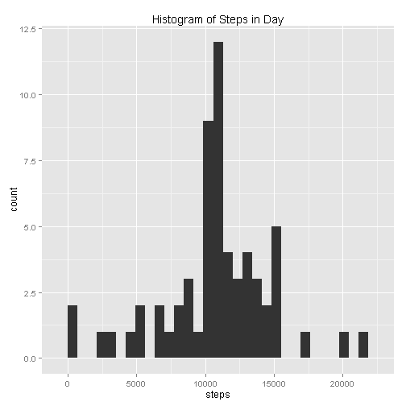

Step 1: Loading the Data

Data was downloaded through the Coursera web site.


```r
data = read.csv("activity.csv")
```

Format the data into usable format


```r
library(reshape)

meltdata = melt(data, id.vars = c("date", "interval"), measure.vars = "steps")
meansdata = cast(meltdata, date~variable, mean, na.rm = TRUE)
mediandata = cast(meltdata, date~variable, median, na.rm = TRUE)
sumdata = cast(meltdata, date~variable, sum, na.rm = TRUE)

intervaldata = cast(meltdata, interval~variable, mean, na.rm=TRUE)

newdata = data
for (i in 1:nrow(data)) {
      
      if (is.na(data[i, 1])) {
            newdata[i, 1] = intervaldata[intervaldata$interval==data[i,3], 2]
            }
      }
meltdata2 = melt(newdata, id.vars = c("date", "interval"), measure.vars = "steps")
sumdata2 = cast(meltdata2, date~variable, sum, na.rm = TRUE)

intervaldata2 = cast(meltdata2, interval~variable, mean, na.rm=TRUE)      

temp = newdata
temp$times = lapply(newdata$date, strptime, "%Y-%m-%d")
newdata$days = factor(unlist(lapply(temp$times, weekdays)))

temp$weekdays = 0
temp$weekdays[newdata$days=="Monday"] = 1
temp$weekdays[newdata$days=="Tuesday"] = 1
temp$weekdays[newdata$days=="Wednesday"] = 1
temp$weekdays[newdata$days=="Thursday"] = 1
temp$weekdays[newdata$days=="Friday"] = 1

newdata$weekdays = factor(temp$weekdays, labels = c("Weekend", "Weekday"))

meltdata3 = melt(newdata, id.vars = c("date", "interval", "weekdays"), measure.vars = "steps")
intervaldata3 = cast(meltdata3, interval + weekdays~variable, mean, na.rm=TRUE)  
```

Step 2:  Histogram

Make a histogram of the total number of steps taken each day


```r
library(ggplot2)
qplot(data = sumdata, steps, main = "Histogram of Steps in Day")
```

```
## stat_bin: binwidth defaulted to range/30. Use 'binwidth = x' to adjust this.
```

 

```r
mean = mean(sumdata$steps, na.rm = TRUE)
median = median(sumdata$steps, na.rm = TRUE)
```

The mean number of steps per day is: 9354.2295 
The median number of steps per day is: 10395

Step 3: Interval Analysis

Time Series Plot of Interval Mean Steps


```r
qplot(data = intervaldata, interval, steps, geom = "line")
```

 

```r
maxinterval = intervaldata$interval[intervaldata$steps == max(intervaldata$steps)]
```

The interval that contains the highest average number of steps across all days is interval ``835 which averages 206.1698


Step 4: Missing Data


```r
good = sum(complete.cases(data))
missing = nrow(data) - good
```

There are 2304 records with missing data

We will now fill them in with the mean value for each day

Recalculate histogram, mean and median with missing values filled


```r
qplot(data = sumdata2, steps, main = "Histogram of Steps in Day")
```

```
## stat_bin: binwidth defaulted to range/30. Use 'binwidth = x' to adjust this.
```

 

```r
mean2 = mean(sumdata2$steps, na.rm = TRUE)
median2 = median(sumdata2$steps, na.rm = TRUE)
```

With missing values filled:
The mean number of steps per day is: 1.0766 &times; 10<sup>4</sup> 
The median number of steps per day is: 1.0766 &times; 10<sup>4</sup>

Comparatively, with missing values:
The mean number of steps per day is: 9354.2295 
The median number of steps per day is: 10395


Weekdays

Add a new factor to determine the day of the week


```r
qplot(data = intervaldata3, interval, steps, facets = .~weekdays, geom = "line")
```

 


